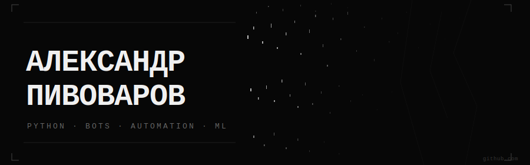

<div align="center">



</div>

<br>

```
> whoami
  александр пивоваров
  python developer · bot builder · ml learner
  russia

> status
  building: AI Telegram Bot SaaS (Gemini · payments · queues)
  learning: django · ml basics · automation
  working:  python developer
```

<br>

---

### стек

<div align="center">


</div>

<br>

---

### проекты

| проект | описание | стек |
|--------|----------|------|
| **[HabitTrackerBot](https://github.com/stonebridgeway/HabbitTrackerBot)** | telegram-бот для трекинга привычек · напоминания · прогресс · admin | aiogram · fastapi · postgresql · redis · celery |
| **[Nexler_Bot](https://github.com/stonebridgeway/Nexler_Bot)** | ai учебный ассистент · fallback-цепочка 25+ llm · история диалога | aiogram · openrouter · sqlite |

<br>

---

### roadmap

```
[✓] HabitTrackerBot       production-style telegram bot · полный стек
[✓] Nexler_Bot            ai ассистент с llm fallback
[→] Django Blogicum       yandex.practicum · sprint 4 · pytest
[→] AI Telegram Bot SaaS  gemini · payments · admin panel · queues
[ ] GitHub Actions CI     автотесты на push
[ ] ML / AI проект        первый публичный ml-pipeline
```

<br>

---

### stats

<div align="center">


</div>

<br>

---

### контакт

[](https://t.me/stonebridgeway)
[](mailto:sachapivorwargpt@gmail.com)

<br>

<div align="center">
<sub>— less noise, more progress —</sub>
</div>
